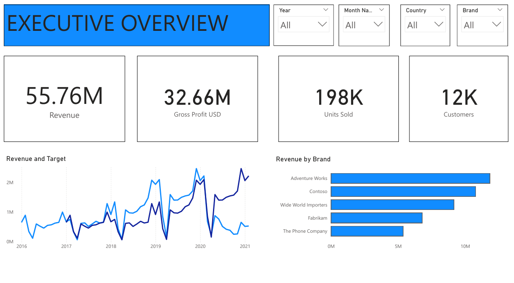
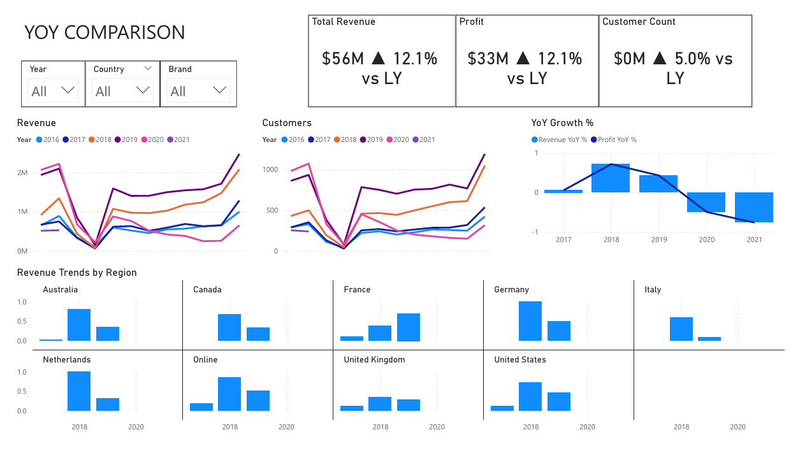

# 📊 Global Electronics Retailer Dashboard (Power BI)

## 📌 Overview
This project presents a **Global Electronics Retailer Dashboard** built in **Power BI**.  
It analyzes multi-year transactional data to provide insights into **revenue, profit, customers, products, and regions**.  

The dashboard is designed for executives and analysts to quickly identify business performance trends, growth opportunities, and underperforming areas.

## 🎯 Objectives
- Track **overall KPIs**: Revenue, Gross Profit, Units Sold, Customer Count  
- Compare performance against **targets and prior years**  
- Detect **seasonal trends and patterns** in sales  
- Highlight **top/bottom products, categories, and brands**  
- Understand **customer behavior** across demographics and geography  
- Assess **regional and store-level performance**

## 🗂️ Dashboard Pages & Features

### 1. **Executive Overview**
- Revenue, Profit, Quantity, and Customers KPIs  
- Revenue vs Target trend (2016–2021)  
- Revenue by Brand (e.g., Adventure Works, Contoso, Fabrikam)  
- Monthly breakdown of Revenue & Profit

  

### 2. **Trends Over Time**
- Revenue & Profit trends (2020–2021)  
- Units sold by category (Audio, Cameras, Cell Phones, Computers, Games…)  
- Monthly customer acquisition & retention  

### 3. **Year-over-Year Comparison**
- Total Revenue ($56M) ▲ 12.1% vs LY  
- Profit ($33M) ▲ 12.1% vs LY  
- Customer Count ▲ 5.0% vs LY  
- Revenue vs Profit YoY %  
- Regional trends (Australia, Canada, France, Germany, Italy, Netherlands, UK, US, Online)
  

## 📊 Tools & Techniques
- **Power BI Desktop** for dashboarding  
- **Power Query** for data cleaning & transformation  
- **DAX (Data Analysis Expressions)** for KPIs and calculated measures  
- **Time Intelligence** functions for YoY, MoM, and seasonal analysis  

Key Insights
- Strong YoY growth in **Revenue (+12.1%)** and **Profit (+12.1%)**.  
- **Customer growth** was more modest at **+5%**, suggesting retention focus needed.  
- Certain categories (e.g., **Cell Phones, Computers**) drive majority of sales.  
- Clear **seasonality patterns**, with revenue peaks during certain months.  
- Regional comparison shows **variations in growth by market** (e.g., US vs EU).

  
